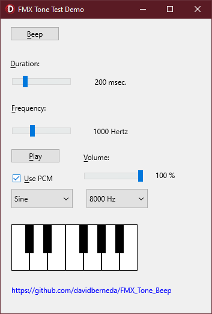

# FMX_Tone_Beep
Delphi multi-platform Firemonkey FMX Beep Tone, for Windows and Android

Play a "Beep", with optional Hertz frequency and duration.

TTone.Play(440, 1000)   // <---  "La" note, 1 second.

TTone.Beep(200)   // Standard "beep" sound, 200 milliseconds

